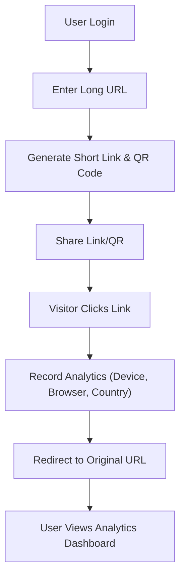

## 1. Product Overview
SnapLink is a full-stack URL Shortener and QR Code Generator web application.
It allows users to convert long URLs into short, shareable links, generate custom QR codes, and track link performance via a detailed analytics dashboard.

## 2. Core Features

### 2.1 User Roles
| Role | Registration Method | Core Permissions |
|------|---------------------|------------------|
| Normal User | Email registration | Shorten URLs, generate QR codes, view analytics dashboard, manage links |

### 2.2 Feature Module
1. **Landing/Auth Page**: Hero section, Login, Signup
2. **Dashboard**: Link list, URL shortening form, QR code display, analytics charts
3. **Redirect Service**: Public endpoint for short link redirection

### 2.3 Page Details
| Page Name | Module Name | Feature description |
|-----------|-------------|---------------------|
| Landing/Auth | Hero & Forms | Project intro, login and registration forms |
| Dashboard | Link Manager | Form to shorten new URLs, list of generated links with copy/delete actions |
| Dashboard | Analytics | Visual charts (Recharts) showing clicks by device, browser, and country |
| Dashboard | QR Display | Auto-generated downloadable QR code for each link |

## 3. Core Process
1. User registers/logs in to the platform.
2. User enters a long URL to shorten.
3. System generates a short code (using nanoid) and a corresponding QR code.
4. User shares the short link or QR code.
5. Visitors click the short link; the system records analytics (IP, country, device, browser) and redirects to the original URL.
6. User views real-time analytics on their dashboard.

## 4. User Interface Design
### 4.1 Design Style
- **Aesthetic**: Modern, clean, and slightly technical "SaaS" look.
- **Colors**: Deep indigo primary (`#4F46E5`), slate dark mode backgrounds, crisp white cards.
- **Button style**: Slightly rounded (rounded-md), subtle hover gradients and shadows.
- **Font**: Inter or Plus Jakarta Sans for a clean, readable UI.
- **Layout**: Sidebar navigation for dashboard, card-based grid for analytics and link items.

### 4.2 Page Design Overview
| Page Name | Module Name | UI Elements |
|-----------|-------------|-------------|
| Auth Pages | Login/Signup Card | Centered floating card, clear inputs, primary CTA button |
| Dashboard | Link Creator | Top sticky bar or prominent card to paste long URLs |
| Dashboard | Link List | Scrollable list of cards showing original URL, short URL, and QR thumbnail |
| Dashboard | Analytics View | Grid of Recharts (bar charts, pie charts) for click data |

### 4.3 Responsiveness
Desktop-first design with responsive flex/grid layouts that adapt to single-column on mobile devices.
