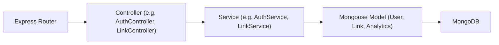
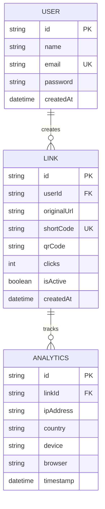

## 1. Architecture Design
```mermaid
graph TD
    subgraph Frontend [Frontend (React + Vite + Tailwind)]
        A["React App (Router, Context/Zustand)"]
        B["Axios (API Client)"]
        C["Recharts (Analytics)"]
        D["qrcode.react"]
    end
    
    subgraph Backend [Backend (Node.js + Express.js)]
        E["Express Router"]
        F["Controllers (OOP Classes)"]
        G["Services (OOP Classes)"]
        H["Mongoose Models"]
        I["nanoid (URL Shortening)"]
        J["jsonwebtoken (Auth)"]
        K["bcryptjs (Password Hash)"]
    end
    
    subgraph Data [Data Layer]
        L["MongoDB (Atlas)"]
    end
    
    A --> B
    B --> E
    E --> F
    F --> G
    G --> H
    H --> L
```

## 2. Technology Description
- **Frontend**: React.js (Vite), React Router DOM, Axios, Recharts, Tailwind CSS.
- **Backend**: Node.js, Express.js, Mongoose, JWT, bcryptjs, nanoid, cors, dotenv.
- **Initialization Tools**: `create-vite`, `npm init -y`.

## 3. Route Definitions
| Route | Purpose |
|-------|---------|
| `/` | Landing page / Auth options |
| `/login` | User login form |
| `/signup` | User registration form |
| `/dashboard` | User dashboard to manage links and view analytics |
| `/:shortCode` | (Backend redirect) Redirect short URL to original |

## 4. API Definitions
- `POST /api/auth/register` (body: `{name, email, password}`)
- `POST /api/auth/login` (body: `{email, password}`)
- `GET /api/auth/profile` (auth token required)
- `POST /api/links` (auth token required, body: `{originalUrl}`)
- `GET /api/links` (auth token required)
- `DELETE /api/links/:id` (auth token required)
- `GET /api/analytics/:linkId` (auth token required)
- `GET /:shortCode` (Public redirect)

## 5. Server Architecture Diagram


## 6. Data Model
### 6.1 Data Model Definition

