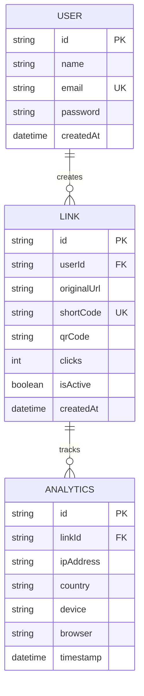

# Entity Relationship Diagram – SnapLink

```mermaid
erDiagram

USER {
    string id PK
    string name
    string email UK
    string password
    datetime createdAt
}

LINK {
    string id PK
    string userId FK
    string originalUrl
    string shortCode UK
    string qrCode
    int clicks
    boolean isActive
    datetime createdAt
}

ANALYTICS {
    string id PK
    string linkId FK
    string ipAddress
    string country
    string device
    string browser
    datetime timestamp
}

USER ||--o{ LINK : creates
LINK ||--o{ ANALYTICS : tracks
```
