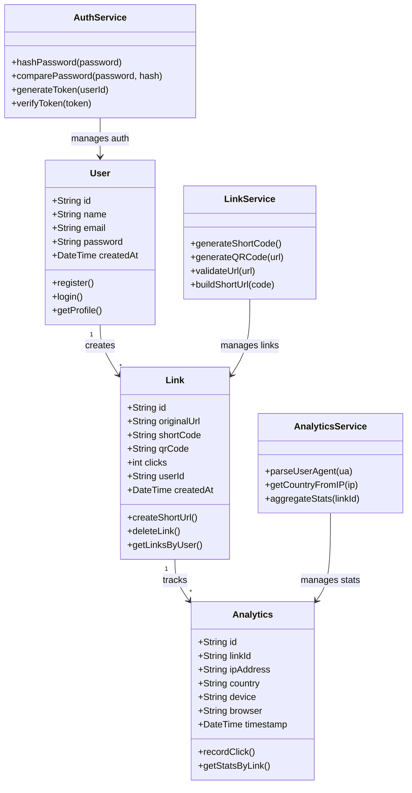

# Class Diagram – SnapLink

```mermaid
classDiagram

class User {
    +String id
    +String name
    +String email
    +String password
    +DateTime createdAt
    +register()
    +login()
    +getProfile()
}

class Link {
    +String id
    +String originalUrl
    +String shortCode
    +String qrCode
    +int clicks
    +String userId
    +DateTime createdAt
    +createShortUrl()
    +deleteLink()
    +getLinksByUser()
}

class Analytics {
    +String id
    +String linkId
    +String ipAddress
    +String country
    +String device
    +String browser
    +DateTime timestamp
    +recordClick()
    +getStatsByLink()
}

class AuthService {
    +hashPassword(password)
    +comparePassword(password, hash)
    +generateToken(userId)
    +verifyToken(token)
}

class LinkService {
    +generateShortCode()
    +generateQRCode(url)
    +validateUrl(url)
    +buildShortUrl(code)
}

class AnalyticsService {
    +parseUserAgent(ua)
    +getCountryFromIP(ip)
    +aggregateStats(linkId)
}

User "1" --> "*" Link : creates
Link "1" --> "*" Analytics : tracks
AuthService --> User : manages auth
LinkService --> Link : manages links
AnalyticsService --> Analytics : manages stats
```
