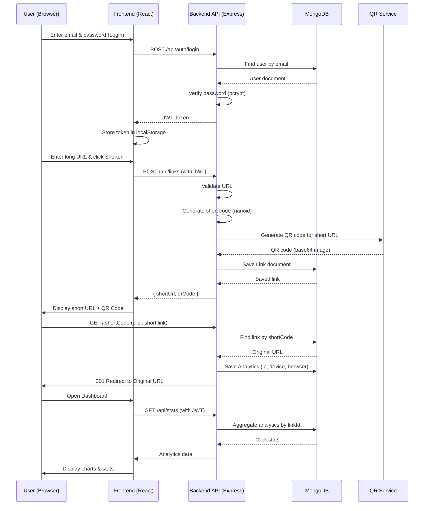

# Sequence Diagram – SnapLink (Main Flow End-to-End)

```mermaid
sequenceDiagram

participant U as User (Browser)
participant FE as Frontend (React)
participant API as Backend API (Express)
participant DB as MongoDB
participant QR as QR Service

%% --- Auth Flow ---
U->>FE: Enter email & password (Login)
FE->>API: POST /api/auth/login
API->>DB: Find user by email
DB-->>API: User document
API->>API: Verify password (bcrypt)
API-->>FE: JWT Token
FE->>FE: Store token in localStorage

%% --- URL Shortening Flow ---
U->>FE: Enter long URL & click Shorten
FE->>API: POST /api/links (with JWT)
API->>API: Validate URL
API->>API: Generate short code (nanoid)
API->>QR: Generate QR code for short URL
QR-->>API: QR code (base64 image)
API->>DB: Save Link document
DB-->>API: Saved link
API-->>FE: { shortUrl, qrCode }
FE->>U: Display short URL + QR Code

%% --- Redirect Flow ---
U->>API: GET /:shortCode (click short link)
API->>DB: Find link by shortCode
DB-->>API: Original URL
API->>DB: Save Analytics (ip, device, browser)
API-->>U: 301 Redirect to Original URL

%% --- Analytics Flow ---
U->>FE: Open Dashboard
FE->>API: GET /api/stats (with JWT)
API->>DB: Aggregate analytics by linkId
DB-->>API: Click stats
API-->>FE: Analytics data
FE->>U: Display charts & stats
```
