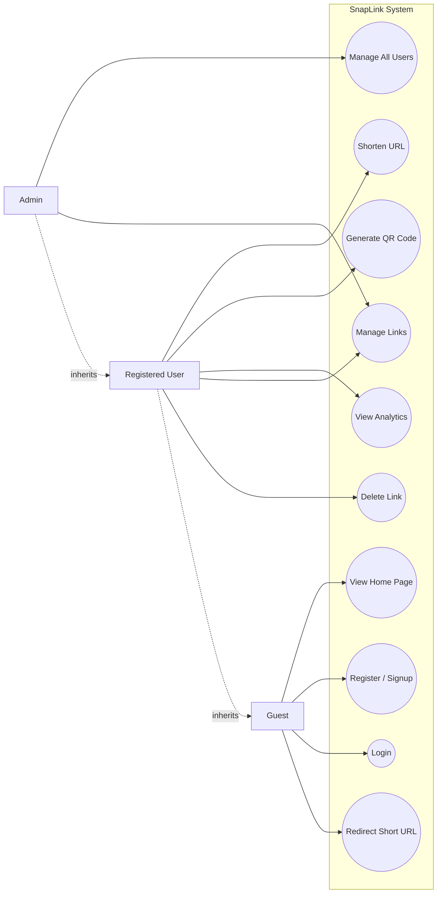

# Use Case Diagram – SnapLink

```mermaid
flowchart LR

    %% Actors
    G[Guest]
    U[Registered User]
    A[Admin]

    %% System Boundary
    subgraph SnapLink System
        UC1((View Home Page))
        UC2((Register / Signup))
        UC3((Login))
        UC4((Shorten URL))
        UC5((Generate QR Code))
        UC6((View Analytics))
        UC7((Manage Links))
        UC8((Delete Link))
        UC9((Redirect Short URL))
        UC10((Manage All Users))
    end

    %% Guest relationships
    G --> UC1
    G --> UC2
    G --> UC3
    G --> UC9

    %% Registered User relationships
    U --> UC4
    U --> UC5
    U --> UC6
    U --> UC7
    U --> UC8

    %% Admin relationships
    A --> UC10
    A --> UC7

    %% Inheritance
    U -. inherits .-> G
    A -. inherits .-> U
```
